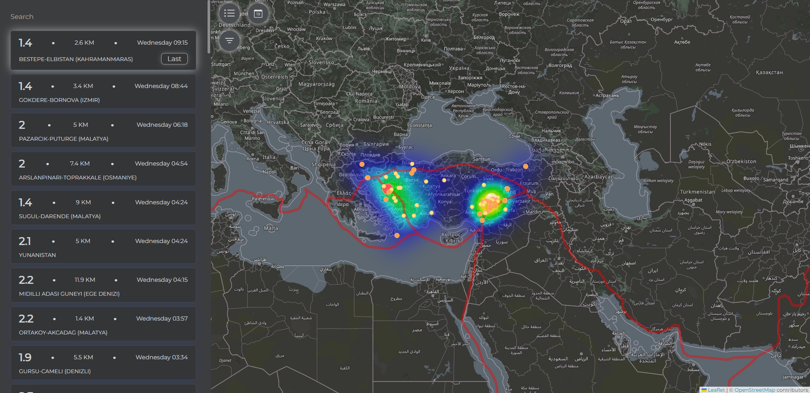
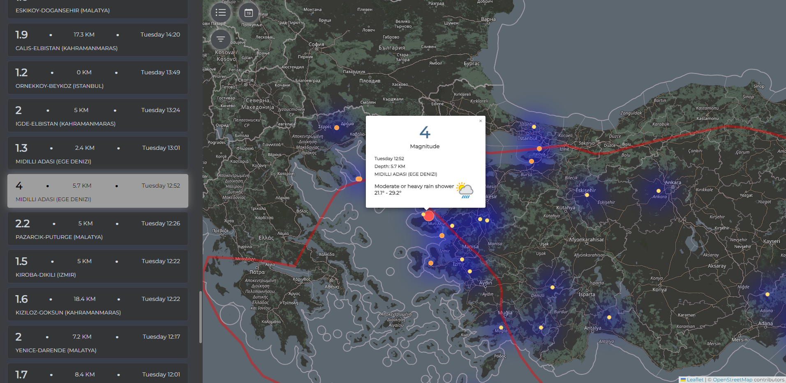
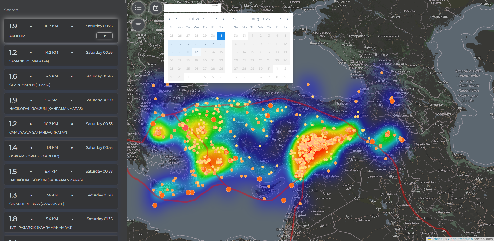
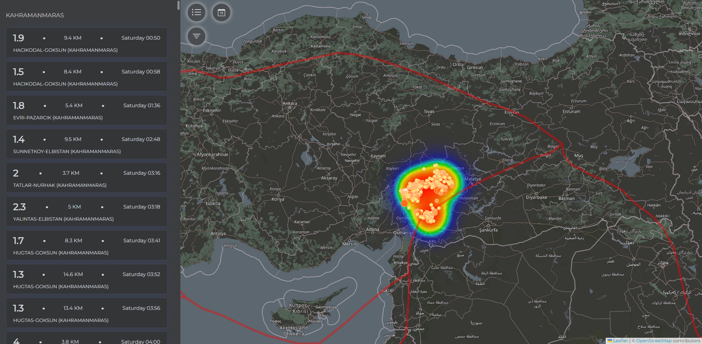
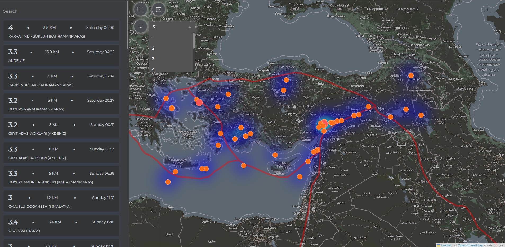

# Earthquake Tracking App

Turkey has earthquake areas, this App shows last and past earthquakes in Turkey, my first purpose is visualize raw earthquake datas with user friendly UI.

# Introduction

This is how App looks like, i used OpenStreetMap as map provider, and leaflet package for interact with map.

We can reach and see about earthquake detail in popup mechanism, popups interact with left side bar and markers, also there is weather forecast information, this information important for earthquake area and weather events can affects earthquake victims badly.

In calendar we can choose past earthquakes and show on map, with heatmap we can see earthquake frequency.

With searchbar we can search and filter earthquakes by cities, it works dynamically 

In magnitude filter we can filter earthquakes by magnitudes, in map each marker depends and changes with earthquake intensity, stronger earthquakes marked with big markers

Live Demo: https://earthquake-tracking-beta.vercel.app

